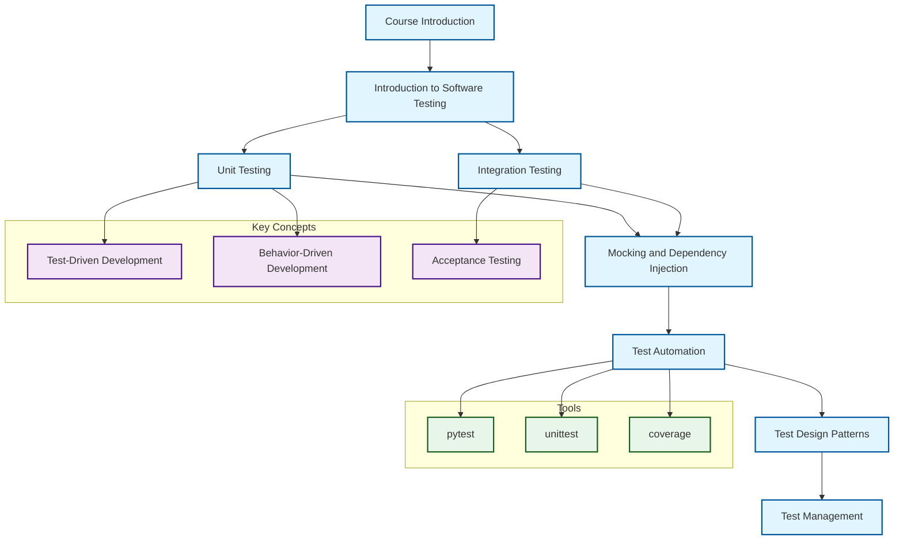

# Syllabus

The syllabus is a document that outlines the course content and objectives. It is important to note that the current syllabus is meant to complement the external course content and is not a replacement for it. In other words, it helps students understand the course and what they will learn., it serves as self-learning material for the instructor. The syllabus contains the course structure, key topics, course materials, key concepts, and resources.

## Course Structure Diagram

## Prerequisites

- Basic knowledge of Python
- Basic knowledge of Git

## Course Overview

This course is designed to introduce students to the fundamentals of software testing.

## Course Objectives

By the end of this course, students will be able to:

- Understand the importance of software testing in the development process
- Understand the different types of software testing

## Course Outline

### Introduction to Software Testing

- What is software testing?
- Why is software testing important?
- What is a test?

### Unit Testing

- What is unit testing?
- Why is unit testing important?
- What is a unit test?
- How to write unit tests?

### Integration Testing

- What is integration testing?
- Why is integration testing important?
- What is an integration test?
- How to write integration tests?

### Mocking and Dependency Injection

- What is mocking?
- Why is mocking important?
- What is a mock?
- How to write mocks?

### Test Automation

- What is test automation?
- Why is test automation important?
- What is a test automation framework?
- How to write test automation?

### Test Design Patterns

- What is a test design pattern?
- Why is a test design pattern important?
- What is a test design pattern?
- How to write test design patterns?

### Test Management

- What is test management?
- Why is test management important?
- What is a test management tool?
- How to write test management?

## Course Content

### Key Topics

- Unit testing
- Integration testing
- Mocking and dependency injection
- Test automation
- Test design patterns
- Test management

### Course Materials

- Python
- pytest
- unittest

### Key Concepts

- Test-driven development (TDD)
- Behavior-driven development (BDD)
- Acceptance testing
- Integration testing
- Unit testing
- Integration testing
- Mocking
- Test automation
- Test design patterns
- Test management

## Resources

- [coverage](https://coverage.readthedocs.io/en/latest/)
- [pytest](https://docs.pytest.org/en/latest/)
- [unittest](https://docs.python.org/3/library/unittest.html)
- [pytest-cov](https://pytest-cov.readthedocs.io/en/latest/)
- [pytest-mock](https://github.com/pytest-dev/pytest-mock)
- [pytest-asyncio](https://github.com/pytest-dev/pytest-asyncio)
